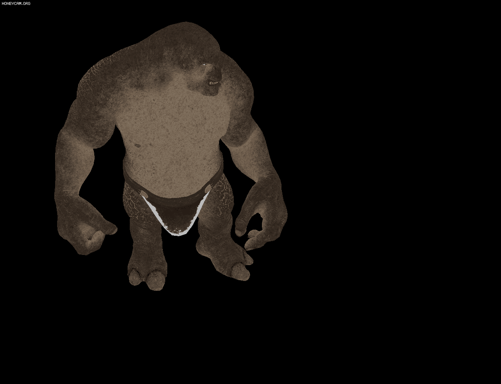

# 5~7주(9월29일 ~ 10월19일)

## 1. gltf모델의 node, mesh, primitive를 추출하여 vertices, indices 드로우 완료


#### 1) [tinygltf](https://github.com/syoyo/tinygltf)
#### 2) [SaschaWillems의 tinygltf 예제](https://github.com/SaschaWillems/Vulkan-glTF-PBR)
#### 3) [사용한 gltf 모델](https://skfb.ly/6YZNJ)

## 2. gltf모델의 material, texture를 추출하여 vertices, indices 드로우에 descriptorSets 적용 완료



#### 1) 1번에서 완성할 수 있었으나, 접근법이 달라 1번에서는 적용하지 못했었음. 
#### 2) 그러나 새로운 접근법을 적용하니 제대로 적용됨.
#### 3) 접근법의 변화
###### - (실패) node -> mesh -> primitive -> material ... 순으로 접근
###### - (성공) node, mesh, primitive, material들을 오브젝트에 vector로 저장(부모-자식 관계는 포인터로 연결), 그리고 필요할때마다 vector만 호출하여 처리
#### 4) 이동 추가
###### - 키보드 이벤트
```
if (glfwGetKey(window, GLFW_KEY_W) == GLFW_PRESS) {
    dir = glm::radians(player->rotateAngle);
    _vec.x = cos(dir) * speed;
    _vec.y = sin(dir) * speed;
}
if (glfwGetKey(window, GLFW_KEY_A) == GLFW_PRESS) {
    player->rotateAngle += rotationSpeed;
}
if (glfwGetKey(window, GLFW_KEY_S) == GLFW_PRESS) {
    dir = glm::radians(player->rotateAngle + 180);
    _vec.x = cos(dir) * speed;
    _vec.y = sin(dir) * speed;
}
if (glfwGetKey(window, GLFW_KEY_D) == GLFW_PRESS) {
    player->rotateAngle -= rotationSpeed;
}
```
###### - 행렬 처리
```
player->root->translation += _vec;
player->root->rotation =
    glm::angleAxis(glm::radians(90.f), glm::vec3(1.f, 0.f, 0.f)) *
    glm::angleAxis(glm::radians(90.f + player->rotateAngle), glm::vec3(0.f, 1.f, 0.f)) *
    glm::angleAxis(glm::radians(0.f), glm::vec3(0.f, 0.f, 1.f));
//scale 생략
```
