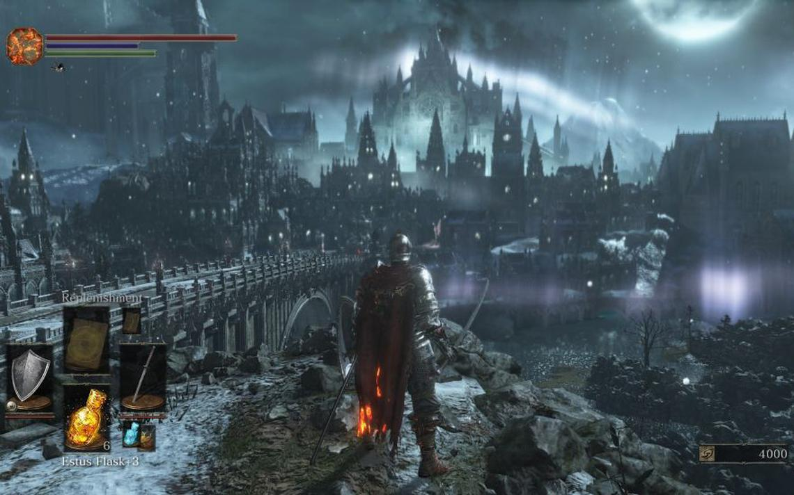
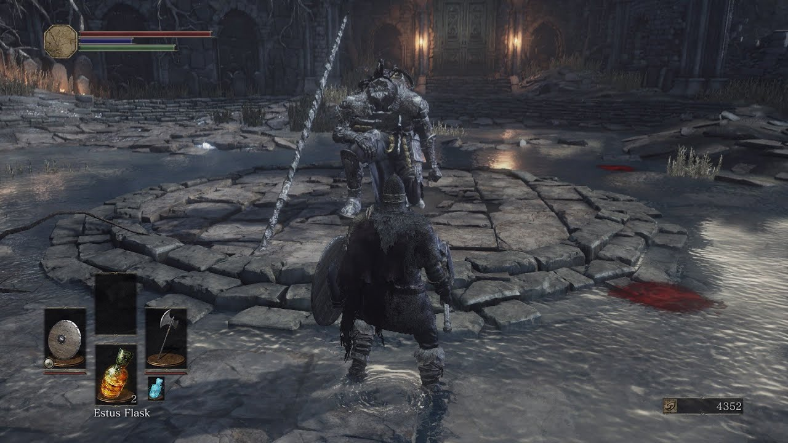
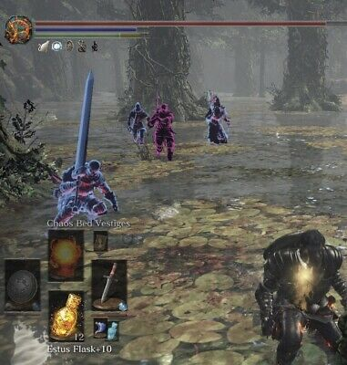

# 포트폴리오2
&nbsp;
## 0. 목차
#### 1) [컨셉](#1)
#### 2) [관련 이미지, 영상](#2)
#### 3) [구성요소](#4)
#### 4) [시스템 디자인](#5)
#### 5) [요구사항](#6)
#### 6) [키 이벤트](#7)
#### &) [용어 정리](#8)
#### 8) [주별 개발작업 계획](#9)
#### 9) [주별 개발작업 결과](Results/index.md)
&nbsp;
## 1. 컨셉
#### 1) 메인 컨셉 (1): 판타지
#### 2) 서브 컨셉 (2): 어두운 세계관
#### 3) 서브 컨셉 (3): 생존 요소
#### 4) 서브 컨셉 (4): 현실성있는 전투
&nbsp;
## 2. 관련 이미지, 영상
#### 1) 관련 이미지
- 
- 
- 
#### 2) 관련 동영상
- 
&nbsp;
## 3. 구성요소
#### 1) 매커니즘
#### 2) 시놉시스 및 세계관
#### 3) 그래픽 컨셉
- 전체적인 시각적 컨셉
- 리얼한 그래픽 / 만화스럽게 / 밝은톤 / 어두운톤 등등 기획컨셉을 반영
- 타이틀 / 인트로 / 엔딩 영상
#### 4) 사운드 컨셉
#### 5) 조작 인터페이스
#### 4) 기술
- 플랫폼은 윈도우
#### 5) 장르
- 롤플레잉
#### 6) 기획 의도
- 게임이 플레이어에게 어떤 재미를 주는지
- 어떻게 플레이어가 지루하지 않게 계속 몰입하고 싶게 하는지

#### 1) 기술
- c++ vulkan 자체엔진을 이용하여 개발
- 플랫폼은 윈도우
#### 2) 기획 의도
- 계속 도전하게하여 성취감을 느끼게함으로서 재미를 주기
- 너무 어렵지 않게 밸런스 조정을 하고 패턴을 쉽게 파악할 수 있게 제작하기
#### 3) 장르
- 롤플레잉
#### 4) 플레이 방식
- 게임의 목표는 최종보스를 죽이면 달성
- 천천히 자신의 캐릭터를 육성하면서 최종보스에 도달후 최종보스와 전투
#### 5) 시놉시스 및 세계관
- 중세판타지 배경의 세계관
- 어느 왕국의 궁정마법사가 모종의 이유로 인해 궁정마법사 직위를 박탈당하고 추방당할 위기에 처했다. 이후 그 궁정마법사는 이미 망한 신세 모두 다같이 죽자며 왕국 궁전 한복판에 악마들을 소환하고는 자살한다. 왕국은 악마들에 의해 쑥대밭이 되어버렸고 찬란했던 왕국은 멸망하게 된다. 그 와중 왕도에서 살아남은 어느 기사. 그 기사는 이 사실을 지방 영주들에게 알리고 군을 조직하기위해 왕도를 탈출하기로 마음먹게되는데...
#### 6) 그래픽 컨셉
- 리얼한 그래픽과 어두운 그래픽을 섞은듯한 느낌
#### 7) 사운드 컨셉
- 중세 판타지가 배경인 만큼 검이 부딪히는 소리나 마법 소리 등등을 사용
&nbsp;
## 4. 시스템 디자인
#### 1) 게임 오브젝트 분해
#### 2) 파라미터
#### 3) 상태
#### 4) 플레이어 속성
&nbsp;
## 5. 요구사항
&nbsp;
## 6. 키 이벤트
&nbsp;
## 7. 용어 정리
&nbsp;
## 8. 주별 개발작업 계획
&nbsp;
