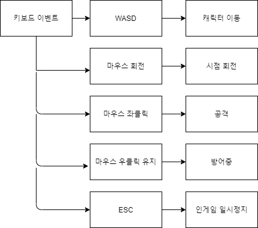
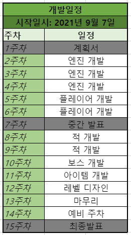

# LastKnight
&nbsp;
## 0. 목차
#### 1) [컨셉](#1)
#### 2) [관련 이미지, 영상](#2)
#### 3) [구성요소](#4)
#### 4) [시스템 디자인](#5)
#### 5) [요구사항](#6)
#### 6) [키 이벤트](#7)
#### 7) [주별 개발작업 계획](#9)
#### 8) [주별 개발작업 결과](Results/index.md)
&nbsp;
## 1. 컨셉
#### 1) 컨셉 (1): 다크 판타지
- 중세시대 배경에 다크판타지가 첨가된 배경을 컨셉으로 잡아 게임을 제작.
#### 2) 컨셉 (2): 현실성있는 전투
- 검의 날이 달아 공격력이 낮아지거나, 검을 내리쳐서 부러뜨리거나, 방패를 부수거나 등등.. 
- 하드코어한 전투 시스템을 서브 컨셉으로 잡아 게임을 제작.
&nbsp;
## 2. 관련 이미지, 영상
#### 1) 관련 이미지
- 
- 
- 
#### 2) 관련 동영상
- 
- 
&nbsp;
## 3. 구성요소
#### 1) 기술
- c++ vulkan 자체엔진을 이용하여 개발
- 플랫폼은 윈도우
#### 2) 기획 의도
- 계속 도전하게하여 성취감을 느끼게함으로서 재미를 주기
- 너무 어렵지 않게 밸런스 조정을 하고 패턴을 쉽게 파악할 수 있게 제작하기
#### 3) 장르
- 롤플레잉
#### 4) 플레이 방식
- 게임의 목표는 최종보스를 죽이면 달성
- 천천히 자신의 캐릭터를 육성하면서 최종보스에 도달후 최종보스와 전투
#### 5) 시놉시스 및 세계관
- 중세판타지 배경의 세계관
- 어느 왕국의 궁정마법사가 모종의 이유로 인해 궁정마법사 직위를 박탈당하고 추방당할 위기에 처했다. 이후 그 궁정마법사는 이미 망한 신세 모두 다같이 죽자며 왕국 궁전 한복판에 악마들을 소환하고는 자살한다. 왕도는 악마들에 의해 쑥대밭이 되어버렸고 폐허가 되어버린다. 그 와중 왕도에서 살아남은 어느 기사. 그 기사는 이 사실을 지방 영주들에게 알리고 군을 조직하기위해 왕도를 탈출하기로 마음먹게된다.
#### 6) 그래픽 컨셉
- 리얼한 그래픽과 어두운 그래픽을 섞은듯한 느낌
#### 7) 사운드 컨셉
- 중세 판타지가 배경인 만큼 검이 부딪히는 소리나 마법 소리 등등을 사용
&nbsp;
## 4. 시스템 디자인
#### 1) 게임 오브젝트 분해

|명칭|설명|
|---|---|
|플레이어|말 그대로 플레이어. 게임을 진행하는 플레이어의 캐릭터.|
|적|플레이어의 진행을 방해하는 적 캐릭터들.|
|보스|지역별로 존재하는 보스 캐릭터.|
|아이템|획득가능한 아이템들.|

#### 2) 파라미터
###### 2.1) 플레이어

|명칭|설명|
|---|---|
|생명력|플레이어의 생명력. 0이 되면 죽는다.|
|지구력|플레이어의 지구력. 공격, 구르기, 달릴때마다 지구력이 감소한다.|
|방어구|현재 플레이어가 장착한 방어구. 클래스 객체이며, 객체 안에 방어력이나 부위별 내구도 등 여러 변수가 존재한다.|
|무기|현재 플레이어가 장착한 무기. 클래스 객체이며, 객체 안에공격력이나 부위별 내구도 등 여러 변수가 존재한다.|

###### 2.2) 적

|명칭|설명|
|---|---|
|생명력|적의 생명력. 0이 되면 죽는다.|
|공격력|적의 공격력.|
|패턴|적의 패턴 정보. 클래스 객체이며, 객체 안에 적의 패턴 정보가 들어있다. 적은 이 객체를 이용하여 패턴을 구사한다.|

###### 2.3) 보스

|명칭|설명|
|---|---|
|생명력|적의 생명력. 0이 되면 죽는다.|
|공격력|적의 공격력.|
|페이즈 넘버|보스가 가지고있는 페이즈의 수(1페이즈, 2페이즈, ...)|
|패턴들(배열, 크기: 페이즈 넘버)|보스의 패턴 정보들. 객체 배열이다. 객체 배열들 안에 패턴 클래스 객체들이 들어있다. 보스는 이 객체 배열을 이용하여 패턴을 구사한다.|

###### 2.4) 아이템

|명칭|설명|
|---|---|
|획득되는 아이템|플레이어가 상호작용시 획득하게 되는 아이템의 종류.|
|획득했는가? (논리형)|획득했는가를 따지는 논리형 변수. 오브젝트 풀링 기능을 위해 구현해둔 변수이다.|

&nbsp;
## 5. 요구사항
#### 1) 시작화면
###### 1.1) 메인
- 어두운 배경.
- 화면 상단에는 *LastKnight*라 적혀있는 텍스트가 있다.
- 화면 중앙에는 새로운 시작, 이어서, 환경설정, 게임종료 버튼들이 있다.
###### 1.2) 새로운 시작, 이어서
- 4개의 데이터 슬롯이 보인다.
- 각 슬롯에는 저장된 게임의 정보가 보인다. 
- 해당 슬롯에 저장된 게임이 없다면 정보가 보이지 않는다.
###### 1.3) 환경설정
- 그래픽 탭, 사운드 탭이 존재한다.
- 그래픽 탭에서는 해상도, 화면모드, 그래픽 퀄리티 설정이 존재한다.
- 사운드 탭에서는 BGM, BGS, SE 설정이 존재한다.
- 화면 우측 하단에는 적용 후 나가기 버튼이 존재한다.
#### 2) 게임화면
- 3d 씬.
- 게임 레벨이 보인다.
- 3인칭 시점이며, 화면 중앙 하단쯤에 플레이어 캐릭터가 보인다.
- 화면 좌측 상단에 생명력, 지구력 게이지가 보인다.
- 화면 좌측 하단에는 방어구의 상태가 보인다.
- 화면 우측 하단에는 무기의 상태가 보인다.
###### 2.1) 인게임 일시정지 화면
- ESC를 눌러 인게임 일시정지 화면을 열 수 있다.
- 게임 재개, 저장, 다른이름으로 저장, 불러오기, 환경설정, 타이틀로 나가기, 바탕화면으로 나가기 버튼들이 있다.
- 다시 ESC를 눌러 인게임 일시정지 화면을 종료하고 게임화면으로 넘어갈 수 있다.
&nbsp;
## 6. 키 이벤트
- 
&nbsp;
## 7. 주별 개발작업 계획
- 
&nbsp;
